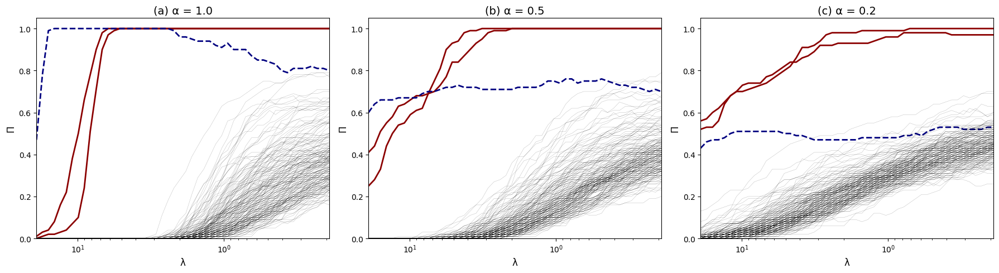
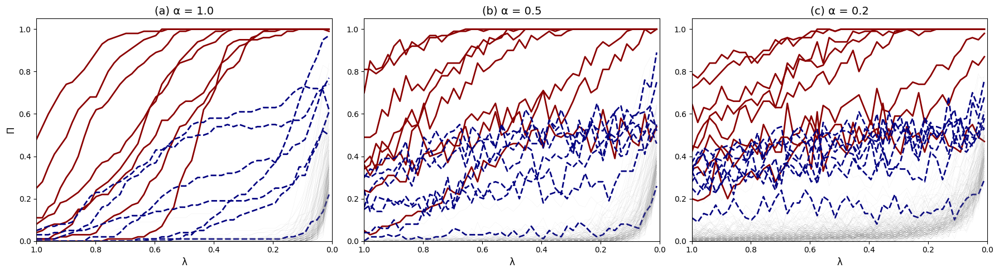
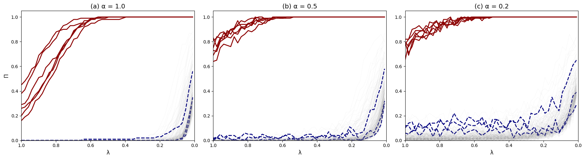
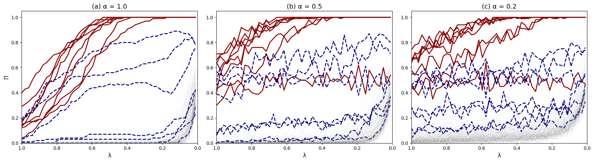

# Stability Selection: Reproducing and Extending Meinshausen & Bühlmann (2010) 
## Aarti Garaye 
### Final Project — PSTAT 234: Statistical Data Science 
### UC Santa Barbara

December 8, 2025

---

# Overview & Introduction

## Background
High-dimensional regression suffers from unstable variable selection. Especially when $p \gg n$
- Small changes in data results in a completely different set of predictors

**Meinshausen & Bühlmann (2010)** propose a way to make variable selection robust even when $p \gg n$ and predictors are highly correlated 

The paper tackles the challenge of choosing the right amount of regularization in high dimensional models by introducing a generic **subsampling-based** approach. 

It is then further improved by adding **randomization in variable selection.**

---

# What is Stability Selection?

Stability selection is a framework that turns unstable sparse estimators (Lasso, stepwise selection, graphical modelling, etc) into reliable variable selectors. 

**Key Idea:**
- Instead of fitting one variable selection method on the full dataset, fit them repeatedly on subsamples. 

Stability selection is esentially a wrapper around any estimator, designed to control false positives.

---

# What is Stability Selection?

**How it works?**
Given a variable selection method (lasso, forward selection, etc.), stability selection:
1. Draw a subsample of size $m = \frac{n}{2}$ (without replacement)
2. Re-runs the variable selection procedure on each subsample. 
3. Computes selection probabilities for each variable.
4. Chooses variables whose selection probability exceeds a threshold $\pi_{thr}$
Formally, for variable $k$,
$$\hat{\Pi}_k = \frac{1}{B}\sum_{b=1}^B I\{k \in \hat{S}^{(b)} \}$$
where $\hat{S}^{(b)}$ is the set of selected variables in subsample $b$.

---

# Why Subsamples of size $\frac{n}{2}$ 

- Meinshausen & Bühlmann show that finite-sample error control (bounds on false positives) is derived specifically for half-samples. 
- Using $m=n/2$ ensures each subsample is different enough to create variability, but still large enough for sparse estimators to perform reasonably.
- It maximizes the difference between subsamples while keeping the statistical signal intact.

---

# Why Subsamples of size $\frac{n}{2}$ 

This choice is theoretically tied to their **Theorem 1**, which provides the false-positive bound:
$$\mathbb{E}[V] \le \frac{q^2}{(2\pi_{thr}-1)p}$$
and this bound only holds cleanly for $m = n/2$. 

**What are $\bf{V, q, \textbf{ and } p}$?**
$p$: total number of variables
$q$: average number of selected variables in a subsample
$V$: number of false positive variables

---

# Figure 4 Setup

To illustrate Stability selection consider a simulated data where $n=p=200$ with $X_1$ and $X_2$ as the only two true variables with $X_3$ being correlated with $X_1$ and $X_2$. 
- Predictor variables are sampled from an $\mathcal{N}(0,\Sigma)$ distribution where $\Sigma$ is the identity matrix except for $\Sigma_{13} = \Sigma_{23} = \rho$ and their symmetric counterparts.
- $\beta = (1,1,0,...)$
- The response variable is obtained from a linear model, $Y = X\beta + \epsilon$ where $\epsilon_{1},...,\epsilon_{n}$ are IID $\mathcal{N}(0,\frac{1}{4})$

---

# Lasso and Why It Fails

The Lasso estimator solves
$$\hat{\beta} = \arg \min_{\beta}\left(||Y - X\beta||_2^2 + \lambda||\beta||_1 \right)$$
Lasso performs variable selection through the $\mathcal{l}_1$-penalty, but its ability to select the correct support requires strong conditions on the design matrix. 

The key one is the **Irrepresentable Condition** (Zhao and Yu, 2006; Zou, 2006; Yuan and Lin, 2007):
$$\max_{k\in N}\Big|\text{sgn}(\beta_S)^T (X_S^TX_S)^{-1}X_S^TX_k\Big| < 1$$

The irrelevant variables $X_k$ must not be too correlated with the true variables, $X_S$. If this is violated, Lasso consistently includes the wrong variables.

---

# Randomized Lasso

To overcome Lasso's sensitivity to correlated predictors, Meinshausen & Bühlmann introduce the **Randomized Lasso**:
- Each variable is randomly reweighted before running Lasso
- Weights $W_k$ are drawn independently from $W_k \sim \text{Uniform}(\alpha, 1)$ for $\alpha \in [0,1]$
$$\hat{\beta}^W = \arg \min_{\beta}\left(||Y - X\beta||_2^2 + \lambda\sum_{k=1}^{p}\frac{|\beta_k|}{W_k} \right)$$

- Small $W_k \rightarrow$ variable $k$ is penalized more. 
- Over repeated randomizations, true variables survive, correlated noise does not
- Works even if the irrepresentable condition is violated.

---

# Violation of Irrepresentable Condition (Fig 4 data)
Recall the setup for figure 4, if we consider $\rho > 0.5$ the Irrepresentable is violated. For theoretical analysis (proving when it's violated asymptotically), we work with $\Sigma$, the population covariance
As $n \rightarrow \infty$, by the law of large numbers
$$\frac{1}{n}X_S^TX_S \xrightarrow[]{p} \Sigma_{SS} \quad \text{ and } \quad \frac{1}{n}X_S^TX_k \xrightarrow[]{p}\Sigma_{Sk}$$
Then, for random design the standard approach is to see the condition in the limit.

---

# Violation of Irrepresentable Condition (Fig 4 data)
Recall,
$\Sigma_{SS} = \begin{bmatrix} 1 & 0 \\ 0 & 1 \end{bmatrix} = I_2$ and $\Sigma_{Sk} = \Sigma_{S3} = \begin{pmatrix} Cov(X_1,X_3) \\ Cov(X_2,X_3) \end{pmatrix} = \begin{pmatrix} \rho \\ \rho \end{pmatrix}$
Then,
$$\beta_S^T \Sigma_{SS}^{-1} \Sigma_{Sk} = (1 \ 1) \begin{bmatrix} 1 & 0 \\ 0 & 1 \end{bmatrix} \begin{bmatrix} \rho \\ \rho \end{bmatrix} = 2\rho$$
In order for Lasso to work,
$$2\rho < 1$$
Thus, the condition breaks for $\rho > 0.5$ assuming $\rho$ is positive. 

---

# Stability Selection for Figure 4
Stability selection requires fitting Lasso over a range of regularization strengths. We follow the paper’s approach by computing a logarithmic $\lambda$-grid. 
For each $\alpha$ (amount of regularization) I run: 
- 100 subsamples of size $n/2 = 100$ drawn without replacement
- On each subsample, we run standard lasso, moderate randomized lasso, and extreme randomized lasso. 
- Record whether variable $k$ is selected at each $\lambda$
- Compute selection probabilites. These $\Pi_k(\lambda)$ curves are the stability paths.

---

# Stability Selection for Figure 4

I used $\rho = 0.8$ which violates the irrepresentability condition.
- **Red curves**: the true variables
- **Blue dashed curve**: correlated noise variable
- **Grey curves**: remaining irrelevant variables

---

# Extention 1: More Realistic
To stress-test stability selection and randomized Lasso, I extend the simulation to a harder and more realistic regime: 
- 8 true variables
- 7 noise variables each correlated with one true variable
- Covariance matrix has heterogeneous variances (uniform in [0.5, 2])
- Correlation strength ρ is 0.95

---

# Violation of Irrepresentable Condition For the Extension
Let, $S = \{1, ... , 8\}$ be the set of true variables and $C = \{9, ... 15\}$ be the correlated noise set. Then, the true coefficients $\beta_j = 1$ for $j \in S$ so $\text{sgn}(\beta_S) = \bf{1}_8$
For each correlated noise index $j \in C$ there is a unique pair true index $t = t(j)$ and $\Sigma_{jt} = \Sigma_{tj} = \rho; \quad \Sigma_{jk} = 0 \text{ for } k \neq t$
The diagonals of the correlation matrix are:
$$d_1 = 1.455, d_2 = 0.905, d_3 = 0.561, d_4 = 0.740, d_5 = 1.720, d_6 = 1.869, d_7 = 1.410, d_8 = 1.594$$

---
# Population Raw Condition
Recall, $\Sigma_{SS}$ is just diagonals so $\Sigma_{SS}^{-1} = (d_1^{-1}, ... , d_8^{-1})$
For correlated $j$ only the $t_j$ entry of $\Sigma_{Sj}$ is $\rho$. So,
$$\Sigma_{SS}^{-1}\Sigma_{Sj} = (0,...,0,\rho d_t^{-1}, 0, ... 0)$$
Then, multiplying by $\text{sgn}(\beta_S^{-1})$ gives
$$|\rho d_t^{-1}| = \frac{\rho}{d_t}$$
Thus, 
$$\max_{j\in C} \frac{\rho}{d_t} < 1 \implies \rho < \min_{t \in S}d_t$$
Then, the condition is violated when $\rho > d_3 = \rho > 0.561$

---
# Standardized Predictors
In practice, we standardize each column $X$ before Lasso. The population analogus is then to replace $\Sigma$ by $R$ where
$$R := D^{-1/2}\Sigma D^{1/2} \quad D = \text{diag}(\Sigma_{11}, ..., \Sigma_{pp})$$
Then the condition is,
$$|\text{sgn}(\beta_S)^T R_{SS}^{-1}R_{Sj}| < 1$$
Because the active block becomes $R_{SS} = \mathbb{1}_{8}$ (true variables are uncorrelated off diagonally in $\Sigma$) we get,
$$|\mathbb{1}_8^T R_{Sj}| = R_{tj}$$

---
# Standardized Predictors
And,
$$R_{tj} = \frac{\Sigma_{tj}}{\sqrt{\Sigma_{tt}\Sigma_{jj}}} = \frac{\rho}{\sqrt{d_t \tilde{d}_j}}$$ 
where $\tilde{d}_j$ are diagonal entries of the correlated variables i.e. the variances of the correlated variables. Then,
$$\max_{j \in C}\frac{\rho}{\sqrt{d_t \tilde{d}_j}} < 1 \implies \rho < \min_{j\in C} \sqrt{d_t \tilde{d}_j}$$
The minimum in our correlation is found at $t=4$ and $j=12$. So, $d_t \tilde{d}_j = d_4\tilde{d}_{12} = 0.732$ 
This means the condition is violated if $\rho > 0.732$. 

---
# Stability Selection for the Extension

My choice of $\rho = 0.95$ violates the condition. Thus, randomized Lasso does fairly better than Standard Lasso. Furthermore, it is important to note that this is only with 100 subsamples. In practice, the standard is much higher.

---
# More Extensions
- Variances are ranging from 0.5 to 10. 
    - Increasing the diagonal variances (heteroskedastic predictors), makes the correlations between variables weaker.
- Same Variance range, 0.5 to 2. But randomly assigning $\rho$ between 0.5 to 0.95
    - The condition does not require single $\rho$
    - It applies to each irrelevant variable individually i.e. the "max" is over all irrelevant variables $j$
        - the condition becomes a separate inequality for each variable $\rho_j < \sqrt{d_{t_{(j)}}\tilde{d}_j} \quad \forall j \in C$
    - Even if on the inequalities is violated i.e. even one bad variables contaminates the entire Lasso path.

---
# Increasing the Range of Variance
**Standardization destroys the intended covariance structure**
We generate
$$Y\sim\mathcal{N}(0,\Sigma)$$
Then we standardize each column. This transforms
$$Y_j^{(std)} = \frac{X}{\sqrt{\Sigma_{jj}}}$$
So the transformed covariance matrix becomes:
$$\Sigma_{jk}^{std} = \frac{\Sigma_{jk}}{\sqrt{\Sigma_{jj}\Sigma_{kk}}}$$

---
# Increasing the Range of Variance
This means the effective correlation between variables j and k is:
$$\rho_{jk}^{std} = \frac{\Sigma_{jk}}{\sqrt{\Sigma_{jj}\Sigma_{kk}}}$$

---
# Random $\rho$

Randomized lasso applies random weights to each predictor. This makes the penalization different in each subsample. So if $W_j$ happens to be small on many subsamples, the effective penalty becomes big making the variable shrink. 

Randomized lasso + stability selection trades: Higher precision for Slightly lower recall

---

# Summary

- Lasso fails when the Irrepresentable Condition is violated  
- Stability selection converts unstable sparse estimators into reliable variable selectors 
- Randomized Lasso introduces diversity in the penalization
- Randomized Lasso + Stability Selection yields:
    - Higher precision (fewer false positives)
    - Better robustness under design violations
    - Better robustness under design violations

---
# References
Meinshausen, N., & Bühlmann, P. (2010).
Stability selection. Journal of the Royal Statistical Society: Series B (Statistical Methodology), 72(4), 417–473.

Tibshirani, R. (1996).
Regression shrinkage and selection via the lasso. Journal of the Royal Statistical Society: Series B, 58(1), 267–288.

Zou, H., & Hastie, T. (2005).
Regularization and variable selection via the elastic net. Journal of the Royal Statistical Society: Series B, 67(2), 301–320.

Hastie, T., Tibshirani, R., & Wainwright, M. (2015).
Statistical Learning with Sparsity: The Lasso and Generalizations. CRC Press.